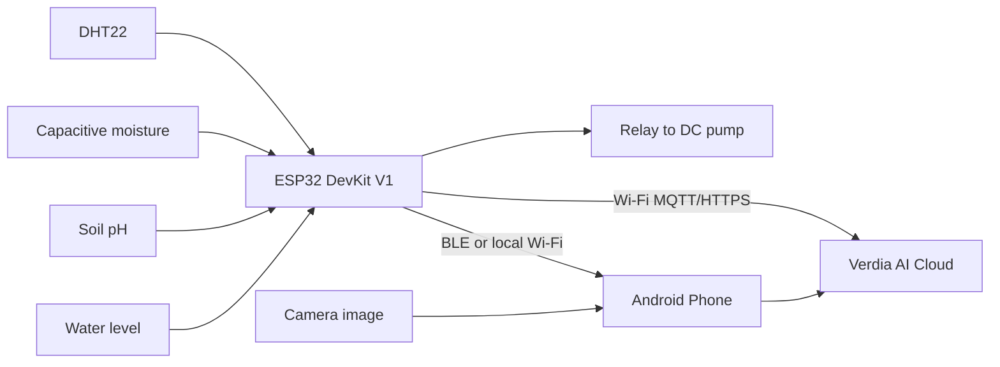

# Verdia AI — System Architecture Reference

Supporting detail for [SKILL.md](SKILL.md). Prefer this over inventing hardware or cloud contracts.

## Official Verdia status

- **Verdia Diagnostics** — field-portable crop monitoring messaging; no public API details.
- **Verdia: AI Plant Identifier** (VerdiaStudio) — plant ID, pest/disease guidance, care tips from photos.
- **Privacy** — collects photos/videos, location, device ID; encrypts in transit; does not share with third parties.
- **Integration stance** — no published SDK/API. Use mock/test endpoints until real contracts exist. Assume HTTPS/TLS and token-style auth only as placeholders.

## Hardware & GPIO (example map)

Exact pins may vary by board revision; document the chosen map in firmware config—do not silently change pins.

| Function | Interface | Example GPIO |
|----------|-----------|--------------|
| DHT22 data | Digital 1-wire | GPIO4 |
| Capacitive soil moisture | ADC | GPIO36 (ADC1_CH0) |
| Soil pH (analog module) | ADC | GPIO39 (ADC1_CH3) |
| Water level (analog) | ADC | GPIO34 (ADC1_CH6) |
| Relay IN (pump) | Digital out | GPIO26 |
| Relay IN (optional fan) | Digital out | GPIO27 |

Power notes:

- ESP32 and 3.3V sensors on 3.3V; relay module often 5V VCC; pump on separate 5–12V switched by relay contacts.
- **Common GND** across ESP32, sensors, and relay supply.
- Capacitive moisture VCC at 3.3V so ADC ≤ 3.3V.
- Water-level probe: drive VCC from a GPIO and power **only during read** to reduce corrosion.

```
  +5V ---+-- Relay VCC
         |             +--- Relay contacts --- (pump supply)
  +3.3V--+-- DHT22 / Moisture / pH / WaterLvl (as rated)
  GND ---- common
  GPIO4  → DHT22 DATA
  GPIO36 ← Moisture OUT
  GPIO39 ← pH OUT
  GPIO34 ← WaterLvl OUT
  GPIO26 → Relay IN1 (pump)
```

## Logical data flow



## Sample telemetry payload (convention only)

```json
{
  "timestamp": "2026-08-03T12:00:00Z",
  "device_id": "ESP32_001",
  "gps": [37.123, -122.456],
  "temperature": 23.5,
  "humidity": 58.2,
  "soil_moisture": 400,
  "soil_pH": 6.4,
  "water_level": 75
}
```

Images: JPEG/PNG via multipart or agreed encoding; include GPS, timestamp, and concurrent sensor fields when the phone uploads. Do not invent Verdia request/response field names beyond what product docs supply.

## Integration options

| Option | Complexity | Latency | Reliability | Security | Power |
|--------|------------|---------|-------------|----------|-------|
| ESP32 → Verdia (Wi-Fi MQTT/HTTP) | Medium | Low | Medium–High if Wi-Fi stable | High with TLS + secured keys | Moderate (Wi-Fi) |
| ESP32 → Phone → Verdia | High | Moderate | Medium (phone present) | Medium (phone secures uplink) | Low on ESP32 (BLE) |
| Hybrid | Very high | Variable | High | High | Mixed |

Default recommendation when always-online Wi-Fi exists: MQTT over TLS for telemetry; phone path for camera and failover.

## Processing split

- **ESP32:** read → calibrate/filter → threshold irrigation → buffer/retry telemetry.
- **Phone:** capture/compress image, attach metadata, gateway when WAN weak, demo UI (live values, charts, Water Now, status).
- **Cloud:** plant identification, diagnostics, historical analytics.

## Calibration expectations

| Sensor | Approach |
|--------|----------|
| pH | Two-point buffers (e.g. 7.00 and 4.00); store offset/slope; recheck periodically |
| Soil moisture | Gravimetric / known volumetric samples → ADC curve per probe/soil type |
| DHT22 | ±0.5°C / ±2% RH typical; ≥2 s between reads; reject spikes; optional moving average |
| Water level | Known immersion points; or ultrasonic time-of-flight vs depth |

## Sampling guidance

- Moisture / pH: ~1–5 minutes (slow dynamics).
- DHT22: ≥2 seconds.
- Water level: higher rate only when pump active if needed; otherwise ≤1 Hz analog.
- Filter: short running average or EMA; min/max sanity bounds; flag physically impossible jumps.

## Security & privacy

- TLS for HTTP and MQTT (e.g. 443 / 8883).
- No hard-coded credentials; rotate tokens; signed OTA when implemented.
- Minimize location/device identifiers; consent; support deletion/retention for images and GPS.
- Follow OWASP IoT / disable unused services; watchdogs for recovery.

## Roadmap phases (product planning only)

Requirements → breadboard prototype → firmware (sensors, control, TLS client) → mobile prototype (parallel) → cloud/mock integration → system integration → bench/field calibration & tests → docs/demo. Overlap firmware and app when staffing allows.
